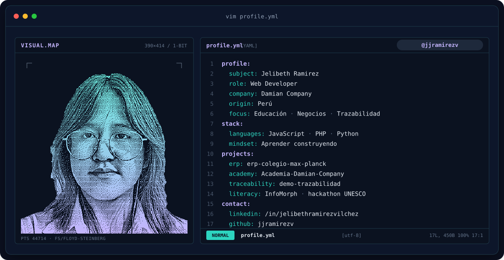

---

## `$ whoami`

## `$ cat tech-stack.yaml`

| `jjramirezv:~$ cat tech-stack.yaml` |
| :--- |
| `├─ ✦ languages:`  |
| `├─ ◧ frontend:`  |
| `├─ ▣ databases:`  |
| `╰─ ⚙ tools:`  |
| `status: learning  ·  mode: building` |

---

## `$ ls ~/projects`

| Proyecto | Descripción | Stack |
| :--- | :--- | :---: |
| [**erp-colegio-max-planck**](https://github.com/jjramirezv/erp-colegio-max-planck) | Portal ERP escolar que centraliza la gestión académica y administrativa del colegio. | JavaScript |
| [**DamianCompany**](https://github.com/jjramirezv/DamianCompany) | Plataforma web con catálogo de maquinaria agrícola, forestal y de construcción, proyectos y cotizaciones por WhatsApp. | PHP |
| [**Academia-Damian-Company**](https://github.com/jjramirezv/Academia-Damian-Company) | Plataforma educativa de robótica, IoT, diseño e impresión 3D y visión por computador. | JavaScript |
| [**demo-trazabilidad**](https://github.com/jjramirezv/demo-trazabilidad) | Demo de trazabilidad agroindustrial: del ingreso de materia prima al despacho del producto terminado. | JavaScript |
| [**InfoMorph**](https://github.com/jjramirezv/InfoMorph) | Plataforma de alfabetización mediática e informacional con IA, creada para un hackathon de la UNESCO. | JavaScript |
| [**landing-page_colegio**](https://github.com/jjramirezv/landing-page_colegio) | Sitio web institucional del Colegio Max Planck, con secciones interactivas. | JavaScript |

---

## `$ kubectl get signals` → `$ cat skills.radar`

---

## `$ git log --graph --contributions`

<picture>
  <source media="(prefers-color-scheme: dark)" srcset="https://raw.githubusercontent.com/jjramirezv/jjramirezv/output/teal-snake-dark.svg">
  <source media="(prefers-color-scheme: light)" srcset="https://raw.githubusercontent.com/jjramirezv/jjramirezv/output/teal-snake-light.svg">
  
</picture>

---

## `$ connect --socials`

Hecho con 💜 y mucho café desde Perú · @jjramirezv

